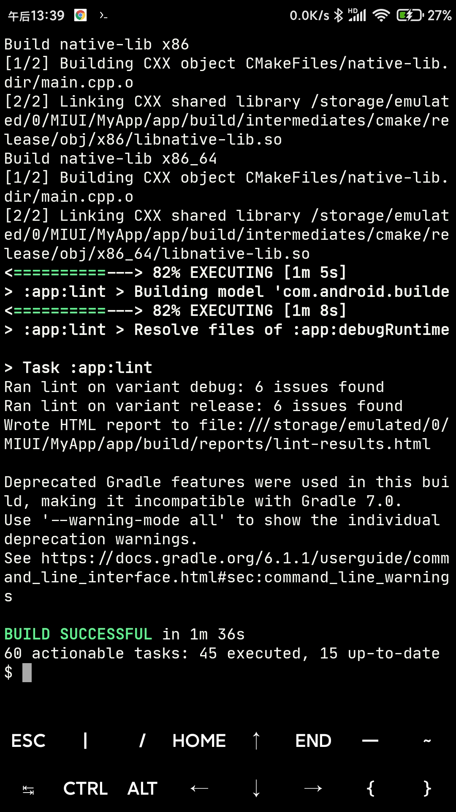
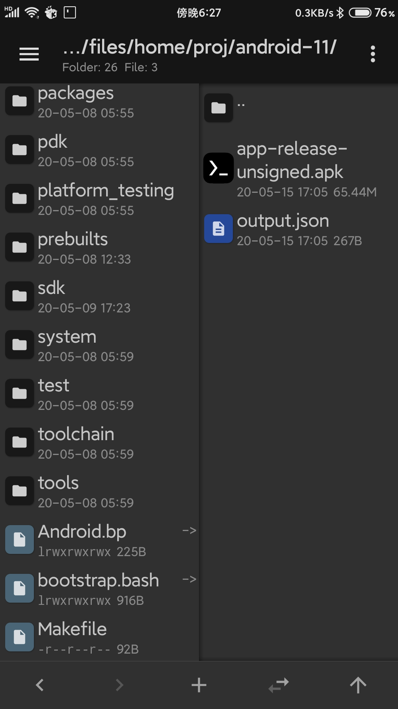

This is Google's standard ndk, which only supports running on Android devices with aarch64 architecture

the source code from AOSP llvm-toolchain master branch, because llvm is cross-platform, so we can recompile it to Android

At first, we don‘t need to rebuild the whole NDK, since google already built most of it.
we only need to build llvm toolchain, then replace the llvm in the NDK.
of course you can build the whole NDK, use checkbuild.py, but the source code is too huge.

##### [download r21.0.6113669](https://github.com/Lzhiyong/termux-ndk/releases)

####  How to build

Termux needs to install aarch64 version of Linux,
I recommend using [TermuxArch](https://github.com/SDRausty/TermuxArch)
, ArchLinux only downloads source code, we are not using it to compile

```bash
# I assume that you have installed the ArchLinux
# install repo
pacman -S repo 

cd /data/data/com.termux/files/home 
mkdir llvm-toolchain && cd llvm-toolchain

# download the source code
repo init -u https://android.googlesource.com/platform/manifest -b llvm-toolchain

# for china
repo init -u https://aosp.tuna.tsinghua.edu.cn/platform/manifest -b llvm-toolchain

repo sync -c -j4

# sync finish, exit ArchLinux
exit

```
 ****

Termux needs to install some build-essential packages, then copy or soft link it to llvm-toolchain/prebuilts

```bash
# remove prebuilt clang under llvm-toolchain/prebuilts, CLANG_PREBUILT_VERSION is defined in llvm-toolchain/toolchain/llvm_android/constants.py
rm -vrf llvm-toolchain/prebuilts/clang/host/linux-x86/CLANG_PREBUILT_VERSION/*

# extract android-ndk-r21.tar.xz to your path
# android-ndk-r21.tar.xz from termux-ndk release
tar -xJvf android-ndk-r21.tar.xz -C /path/to/android-ndk-r21

# copy ndk llvm toolchain to prebuilt clang directory 
 cp -r android-ndk-r21/toolchains/llvm/prebuilt/linux-aarch64/* llvm-toolchain/prebuilts/clang/host/linux-x86/CLANG_PREBUILT_VERSION

# soft link cmake to llvm-toolchain/prebuilts
ln -sf /data/data/com.termux/files/usr/bin/cmake llvm-toolchain/prebuilts/cmake/linux-x86/bin/cmake

# soft link ninja to llvm-toolchain/prebuilts
ln -sf /data/data/com.termux/files/usr/bin/ninja llvm-toolchain/prebuilts/ninja/linux-x86/bin/ninja

# remove prebuilt python under llvm-toolchain/prebuilts
rm -vrf llvm-toolchain/prebuilts/python/linux-x86/*

# apt download python3
# extract /data/data/com.termux/files/usr/var/cache/apt/archives/python_3.8.2_aarch64.deb to llvm-toolchain/prebuilts/python/linux-x86
# or modify llvm-toolchain/toolchain/llvm_android/py3_utils.py 
# golang is the same

# copy libedit to libedit prebuilt dirctory
cp /data/data/com.termux/files/usr/lib/libedit* llvm-toolchain/prebuilts/libedit/linux-x86/lib

# copy swig to swig prebuilt directory
cp /data/data/com.termux/files/usr/bin/swig llvm-toolchain/prebuilts/swig/linux-x86/bin

# modify llvm-toolchain/toolchain/llvm_android/configs.py 
# change sysroot to llvm-toolchain/prebuilts/clang/host/linux-x86/CLANG_PREBUILT_VERSION/sysroot
# There are some that need to be change, please see llvm_android/*.py for details

```

 **** 
###  OK start compile now!

```bash
# no build for windows
python toolchain/llvm_android/build.py --no-build windows
```

 **** 
#### Building binutils
```bash

# execute python toolchain/binutils/build.py
# or you can compile it manually
# host is aarch64-linux-android
# target: arm-linux-androideabi 
#         aarch64-linux-android
#         i686-linux-android
#         x86_64-linux-android

cd binutils && mkdir build && cd build

# setting android ndk toolchain
TOOLCHAIN=/path/to/android-ndk-r21/toolchains/llvm/prebuilt/linux-aarch64

../configure \                                      
    CC=$TOOLCHAIN/bin/aarch64-linux-android29-clang \                                              
    CXX=$TOOLCHAIN/bin/aarch64-linux-android29-clang++ \                                           
    CFLAGS="-fPIC -std=c11" \                       
    CXXFLAGS="-fPIC -std=c++17" \                   
    --prefix=$HOME/binutils/x86_64 \                
    --host=aarch64-linux-android \                  
    --target=x86_64-linux-android \
    --enable-initfini-array \                       
    --enable-plugins \                              
    --enable-gold \
    --enable-lto \
    --enable-libada \
    --enable-liboffloadmic=target \
    --enable-libssp \
    --enable-threads \
    --enable-new-dtags
```

 **** 
#### Simpleperf no need to compile
```bash
cd android-ndk-r21/simpleperf/bin/linux/aarch64

ln -sf ../../android/arm64/simpleperf ./simpleperf

```

 **** 
#### Building shader-tools
```bash
cd /data/data/com.termux/files/home

git clone https://github.com/google/shaderc

cd shaderc/third_party

git clone https://github.com/KhronosGroup/SPIRV-Tools.git   spirv-tools

git clone https://github.com/KhronosGroup/SPIRV-Headers.git spirv-tools/external/spirv-headers
    
git clone https://github.com/google/googletest.git

git clone https://github.com/google/effcee.git

git clone https://github.com/google/re2.git

git clone https://github.com/KhronosGroup/glslang.git


# start building shaderc...

cd ~/shaderc && mkdir build && cd build

# setting android ndk toolchain
TOOLCHAIN=/path/to/android-ndk-r21/toolchains/llvm/prebuilt/linux-aarch64

cmake -G "Ninja" \
    -DCMAKE_C_COMPILER=$TOOLCHAIN/bin/aarch64-linux-android29-clang \
    -DCMAKE_CXX_COMPILER=$TOOLCHAIN/bin/aarch64-linux-android29-clang++ \
    -DCMAKE_SYSROOT=$TOOLCHAIN/sysroot \
    -DCMAKE_BUILD_TYPE=Release \
    -DCMAKE_INSTALL_PREFIX=/path/to/shader-tools \
    ..

ninja install -j16
```

 **** 
#### Building renderscript (llvm-rs-cc and bcc_compat)

build bcc_compat and llvm-rs-cc need older version llvm and clang, download [llvm.tar.xz](https://github.com/Lzhiyong/termux-ndk/releases)
 or you can download the llvm source code to compile it 

if you don't want to compile liblog, change <log/log.h> to <android/log>

```bash
# slang source code
# git clone https://android.googlesource.com/platform/frameworks/compile/slang
# libbcc source code
# git clone https://android.googlesource.com/platform/frameworks/compile/libbcc
# rs souce code
# git clone https://android.googlesource.com/platform/frameworks/rs
# llvm and clang source code
# git clone https://android.googlesource.com/platform/external/llvm
# git clone https://android.googlesource.com/platform/external/clang

# clone termux-ndk
git clone https://github.com/Lzhiyong/termux-ndk.git

# extract llvm.tar.xz to termux-ndk/renderscript
# llvm.tar.xz from termux-ndk release
tar -xJvf llvm.tar.xz -C renderscript

# build llvm-rs-cc
cd renderscript/slang/build
./build.sh

# build bcc_compat
cd renderscript/libbcc/build
./build.sh

```
 **** 
#### Building finish!
llvm-toolchain stage1 and stage2 compilation takes about 10 hours.

If your phone performance is good, the time may be shorter, but it still takes a lot of time to compile.

There may be some errors during the compilation process, please solve it yourself!

 **** 


#### Screenshots

<a href="./screenshot/Screenshot_01.jpg"></a>
<a href="./screenshot/Screenshot_02.jpg"></a>
<a href="./screenshot/Screenshot_03.jpg"></a>


#### Buinding app with ndk cmake

Using termux to build android app.

download the build-essential toolchain, [gradle](https://gradle.org) and [openjdk](https://github.com/Lzhiyong/termux-ndk/releases), 
update [aapt2](https://github.com/Lzhiyong/build-tools) is here.

please note when you execute the gradle build command finish, some errors will occur.
> AAPT2 aapt2-4.0.1-6197926-linux Daemon #7: Daemon startup failed.  
        This should not happen under normal circumstances, please file an issue if it does.

this is because the gradle plugin will download a corresponding version of aapt2.

We need to replace the aapt2, which under /data/data/com.termux/files/home/.gradle 

execute the find command to search for aapt2, find . -type f -name "aapt2\*-linux.jar"
(such as aapt2-4.0.1-6197926-linux.jar or other version)

extract the jar file, aapt2 is inside this jar file, replace it with [sdk-tools](https://github.com/Lzhiyong/build-tools)/build-tools/aapt2

if there are still errors, continue to replace！


```bash

# modify local.properties file
# sdk.dir=/path/to/android-sdk
# ndk.dir=/path/to/ndk
# cmake.dir=/path/to/cmake


# setting the buildToolsVersion
# update buildToolsVersion you need download the sdk-tools, then copy it to android-sdk/build-tools platform-tools
# sdk-tools from https://github.com/Lzhiyong/build-tools
buildToolsVersion "30.0.0-rc1"


# setting the cmake version 
# update cmake you need download the cmake source code to compile it
......

externalNativeBuild {
    cmake {
        // specify the cmake version
        version "3.17.2"
        arguments "-DANDROID_APP_PLATFORM=android-21", "-DANDROID_STL=c++_static", "-fuse-ld=lld"
        abiFilters 'armeabi-v7a', 'arm64-v8a', 'x86', 'x86_64'
    }
}

......

# building examples
cd termux-ndk/cmake-example && gradle build

```

## Issues

Every NDK version has a lot of changes, direct compilation will fail, please solve by yourself.

llvm-rs-cc may have bugs, I rewrote the rs_cc_options.cpp file.

because RSCCOptions.inc compilation error, I can't solve it yet.

RSCCOptions.inc is generated by llvm-tblgen, but which has errors

llvm-tblgen -I=../llvm/include RSCCOptions.tb -o RSCCOptions.inc

if anyone konws, please submit to issue