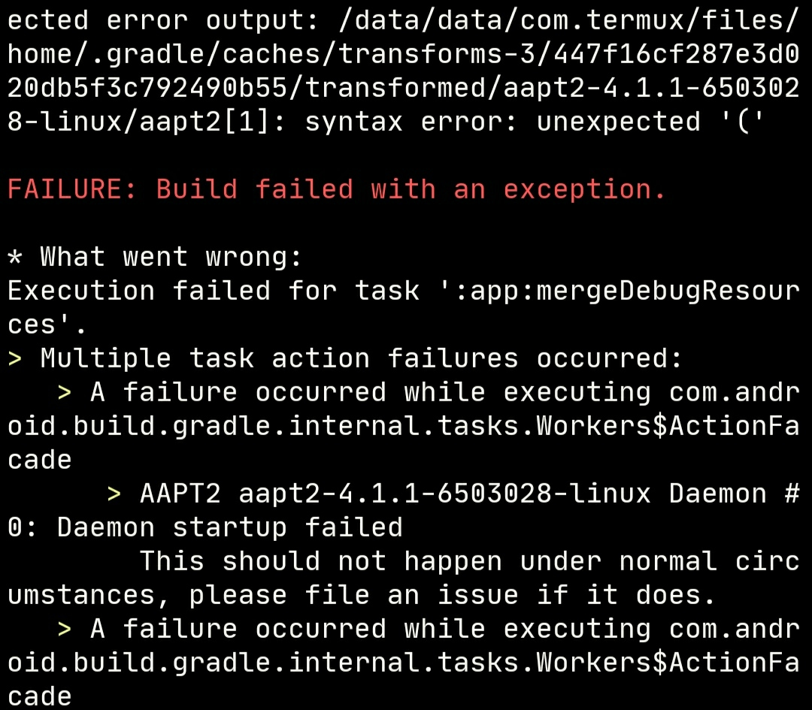

### How to use termux-ndk to build android app

* Download the build-essential toolchain, android-ndk android-sdk openjdk from [release](https://github.com/Lzhiyong/termux-ndk/releases) and [gradle](https://gradle.org) 

* Add a local.properties file to the root of the project as below
   ```bash
   # modify the local.properties file
   # although ndk.dir has been deprecated, but it still works
   sdk.dir=/path/to/android-sdk
   ndk.dir=/path/to/android-ndk
   cmake.dir=/path/to/cmake
   # for example:
   sdk.dir=/data/data/com.termux/files/home/android/android-sdk
   ndk.dir=/data/data/com.termux/files/home/android/android-ndk-r23
   cmake.dir=/data/data/com.termux/files/home/android/android-sdk/cmake
   ```
* Modify the project/build.gradle file
   ```bash
   # setting the gradle plugin version 
   dependencies {
       classpath 'com.android.tools.build:gradle:7.0.2'
   }
   ```
* Modify the project app/build.gradle
   ```bash
   # setting build tools version 30.0.3
   android {
       ...
       buildToolsVersion "30.0.3"
       
       defaultConfig {
           externalNativeBuild {
                cmake {
                   arguments "-DANDROID_APP_PLATFORM=android-30", "-DANDROID_STL=c++_static"
                   abiFilters 'armeabi-v7a', 'arm64-v8a', 'x86', 'x86_64'
               }
           }
       }
       ...
   }
   ```

* Execute the `gradle build` command to start building the android app, when building for the first time, the below error will occur.</br> 
this is because the gradle plugin will download a corresponding version of aapt2-7.0.2-7396180-linux.jar, we need to replace it.
<a href="./screenshot/aapt2_xxx_linux_error.jpg"></a>

* Replace the aapt2 in aapt2-7.0.2-7396180-linux.jar inside with [sdk-tools/build-tools/aapt2](https://github.com/Lzhiyong/sdk-tools/releases)
   ```bash
   # aapt2 is inside the jar file(aapt2-7.0.2-7396180-linux.jar)
   # because the aapt2 is x86_64 architecture not aarch64, so we need to replace it
   # execute the find command to search aapt2-xxx-linux.jar, then replace it
   cd ~/.gradle
   find . -type f -name aapt2-*-linux.jar
   cp /path/to/aapt2-7.0.2-7396180-linux.jar ./caches/modules-2/files-2.1/com.android.tools.build/aapt2/7.0.2-7396180/edbe192dae2621801ae9351b807cf156ade6899e/aapt2-7.0.2-7396180-linux.jar
   ```
   <a href="./screenshot/copy_aapt2.jpg"></a>
   
* If an error occurs during the build app, this may be a network problem, please execute the `gradle build` again or execute the `gradle build --info` for more information.

**** 
### Building termux-app with termux
```bash
git clone https://github.com/termux/termux-app

# add local.properties file to termux-app
sdk.dir=/path/to/android-sdk 
ndk.dir=/path/to/android-ndk 
cmake.dir=/path/to/cmake

# modify gradle.properties file 
# add buildToolsVersion
minSdkVersion=24
targetSdkVersion=28
ndkVersion=23.0.7599858
compileSdkVersion=30
buildToolsVersion=30.0.3

# modify app/build.gradle terminal-emulator/build.gradle and terminal-view/build.gradle
# add buildToolsVersion
android {
    ...
    compileSdkVersion project.properties.compileSdkVersion.toInteger()
    buildToolsVersion project.properties.buildToolsVersion.toString()
    ...
}

# ok start building termux-app
gradle assembleDebug

```
<div align="left">
    
</div>

**** 
### Building example
```bash
# File Manager
cd example/FileManager

# cmake-example
cd example/cmake-example

# hello-jni-kotlinApp
cd example/hello-jni-kotlinApp

gradle assembleDebug
```
<div align="left">
    
</div>

**** 

### Known issues
Using proot or chroot linux is not recommended, this may have some problems, the building speed is much slower than the native Termux.
