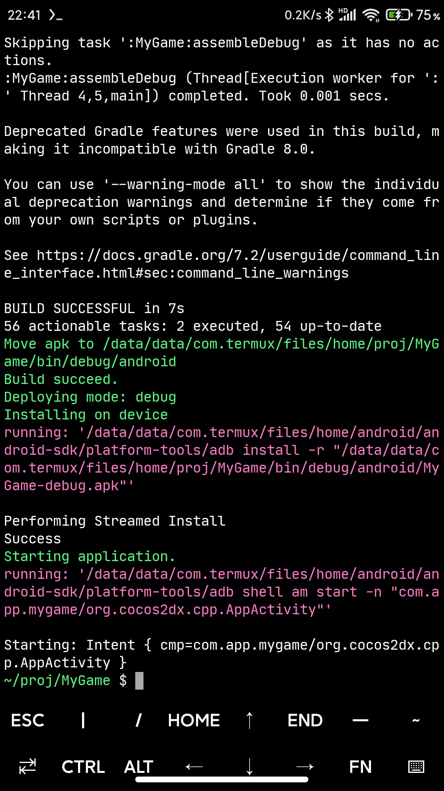
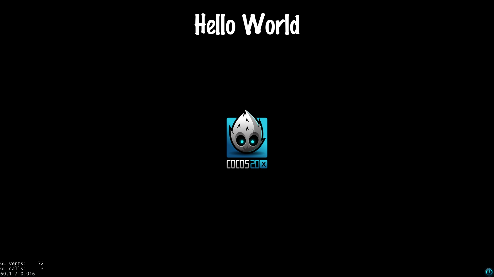

Building cocos2d-x game for android with termux-ndk</br>
For more details information, please refer to [cocos2d-x](https://github.com/cocos2d/cocos2d-x)

#### Install python2
```bash
pkg install python2
```

#### Clone the repo
```bash
# clone the repo to termux from github
git clone https://github.com/cocos2d/cocos2d-x.git
```
#### Download dependencies
```bash
# after cloning the repo, please execute download-deps.py to download and install dependencies
cd cocos2d-x
python2 download-deps.py
```
#### Git submodule
```bash
# after running download-deps.py
git submodule update --init
```

#### Setup the environment
```bash
# the ANDROID_SDK_ROOT will fail
# Error: /path/to/android-sdk is not a valid path of ANDROID_SDK_ROOT Ignoring it.
# modify the setup.py, please refer to the setup.py.patch
# then execute setup.py again
python2 setup.py
source ~/.bashrc
```

#### Modify the templates projects
```bash
cd cocos2d-x/templates/cpp-template-default

# set gradle plugin version
# classpath 'com.android.tools.build:gradle:4.1.2'
vim proj.android/build.gradle

# add Android SDK build-tools version
# PROP_BUILD_TOOLS_VERSION=30.0.3
vim proj.android/gradle.properties

# add buildToolsVersion PROP_BUILD_TOOLS_VERSION.toString()
vim proj.android/app/build.gradle


lua-template-default is the same
```

#### Modify the libcocos2dx
```bash
# add buildToolsVersion PROP_BUILD_TOOLS_VERSION.toString()
cd cocos2d-x
vim cocos/platform/android/libcocos2dx/build.gradle
```

#### Start new game project
```bash
# enable adb for automatic installation of apk files
adb devices
adb devices

# project path
cd /sdcard/projects

# you can also create a Lua project with -l lua
cocos new MyGame -p com.xxx.xxx -l cpp

cd MyGame

# No need to use --proj-dir, this will cause an error, gradle.properties cannot be found
# if you want to use --proj-dir, need to use absolute path, for example --proj-dir /path/to/MyGame/proj.android
cocos run -p android

```

#### Building test
```bash
cd cocos2d-x/tests/cpp-test

# you need to manually modify the build.gradle and gradle.properties files
# please refer to the template project above
cocos run -p android
```

#### Issues fix
* ANDROID_SDK_ROOT</br>
modify `coco2d-x/setup.py`</br>
refer to [setup.py.patch](https://github.com/Lzhiyong/termux-ndk/tree/master/cocos2dx-game/setup.py.patch)

* cmake cannot found</br>
modify `cocos2d-x/tools/cocos2d-console/plugins/plugin_compile/build_android.py`</br>
refer to [build_android.py.patch](https://github.com/Lzhiyong/termux-ndk/tree/master/cocos2dx-game/build_android.py.patch)

* unable to find library from dependent library specifier lua51.lib</br>
modify `cocos2d-x.cocos/scripting/lua-bindings/manual/CCLuaEngine.cpp`</br>
refer to [CCLuaEngine.cpp.patch](https://github.com/Lzhiyong/termux-ndk/tree/master/cocos2dx-game/CCLuaEngine.cpp.patch)

**** 
**Screenshot**
<div align="left">
    
</div>

**Hello World**
<div align="left">
    
</div>

 **** 