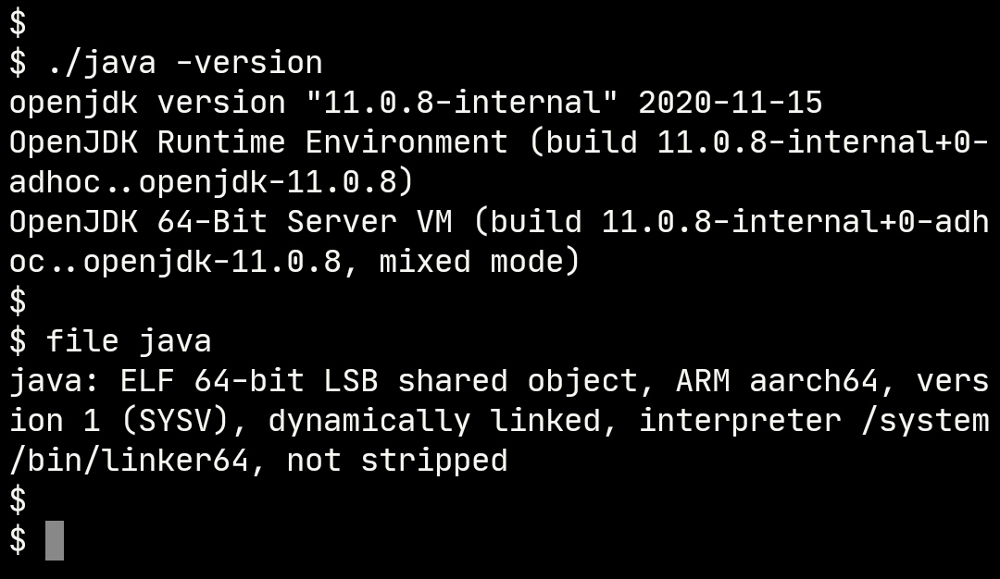

building openjdk-11 for Android with Termux

download the source code from [AdoptOpenJDK/openjdk-jdk11u](https://github.com/AdoptOpenJDK/openjdk-jdk11u) release

#### install X11 packages from x11-repo
```bash
apt install x11-repo
apt install libx11 libxext libxrender libxrandr libxtst libxt xorgproto fontconfig pulseaudio

```

#### building cups
```bash
git clone https://github.com/apple/cups
cd cups 
./configure --prefix=/path/to/libcups
make -j16
```

#### building alsa-lib
```bash
git clone https://github.com/alsa-project/alsa-lib
cd alsa-lib
./gitcompile
./configure --prefix=/path/to/alsa-lib
make -j16
```

#### building openjdk-11
```bash
# I downloaded openjdk-jdk11u-jdk-11.0.8-10_adopt from AdoptOpenJDK
# you can also download other versions


./configure \
    CC=clang \
    CXX=clang++ \
    --with-debug-level=release \
    --with-extra-cflags="-fPIC -fno-emulated-tls" \
    --with-extra-cxxflags="-fPIC -fno-emulated-tls -std=c++11" \
    --with-extra-ldflags="-fuse-ld=lld" \
    --with-toolchain-type="clang" \
    --with-x \
    --with-cups=/path/to/libcups \
    --with-alsa=/path/to/alsa-lib \
    --disable-warnings-as-errors

make JOBS=16

```
#### building finish
<a href="./img/IMG_01.jpg"></a>

 **** 

## Issues

* jdk/lib/libxxx.so has linker warning: unsupported flags DT_FLAGS_1=0x81, please using termux-elf-cleaner to remove it. for example: termux-elf-cleaner \*.so


* jshell has segmentation fault
<a href="./img/IMG_02.jpg"></a>


* Android TLS(thread local storage) seems to have a bug, so add cxxflags -fno-emulated-tls to disable TLS supports, please refer [android-elf-tls](https://github.com/Lzhiyong/termux-ndk/blob/master/openjdk-build/android-elf-tls.md) for more information
>ld.lld: error: libjvm.so: undefined reference to Thread::_thr_current , or libjvm.so: undefined reference to _ZN6Thread12_thr_currentE
>
>Thread::_thr_current defined in src/hotspot/share/utilities/thread.hpp
>
>_ZN6Thread12_thr_currentE defined in src/hotspot/os_cpu/linux_aarch64/threadLS_linux_aarch64.s


* Test if TLS working
cd openjdk-build/tls-test<br>
./build.sh

* On Android Failure
<a href="./img/IMG_03.jpg"></a>

* On TermuxArch (ArchLinux) Success
<a href="./img/IMG_04.jpg"></a>


**If anyone knows, please submit an issue**

